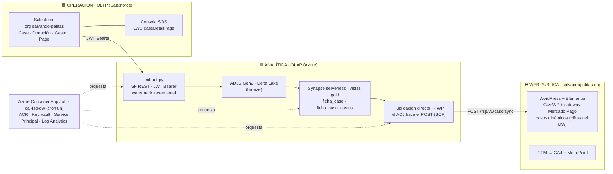

# 🐾 Patitas Stack · Portafolio de Vladislav Marinovich

**Sistemas de información *policy-grade* para el sector social de LATAM**

_De la ingesta del dato a la decisión — arquitectura, ingeniería de datos e IA aplicada al impacto_

---

> **Cómo leer este portafolio — 3 niveles de profundidad:**
> 🟢 **Nivel 1 · Visión** (aquí) · qué hacemos, productos, potencial e investigación.
> 🔵 **Nivel 2 · Arquitectura** · cada [ficha de proyecto](#-los-proyectos) y el [atlas](docs/atlas/): diagramas, diccionario de datos, dominio y máquinas de estado (todo público).
> 🔒 **Nivel 3 · El código** · los repos privados, por **solicitud de acceso** desde cada ficha.

---

## 🎯 Qué hacemos

El sector de protección animal de LATAM opera **a ciegas**: sin trazabilidad del dinero, sin datos de operación, sin forma de demostrar impacto. Construimos el **sistema de información que cambia eso** — uno donde cada peso donado es **trazable públicamente** desde la donación hasta la factura del veterinario, y donde la operación se mide para decidir mejor.

**Métrica norte: vidas salvadas por peso invertido.** Marco: *design science* + sistemas de información (datos reales de campo, no de laboratorio).

## 🐾 El Patitas Stack

Un sistema end-to-end: desde que un ciudadano reporta un animal en condición crítica hasta que el caso se cierra — con trazabilidad financiera por caso. Su columna vertebral es un **split OLTP/OLAP**: Salesforce decide en tiempo real, un warehouse serverless en Azure computa la historia, y la web es una vitrina pasiva de cifras reales.

📐 **[Atlas completo de arquitectura →](docs/atlas/)** · 6 diagramas (panorámica, dominio, data platform, infraestructura, web y el loop de transparencia).

## 🚀 Potencial

- **Infraestructura reutilizable** para el sector animalista de LATAM — un terreno **sin benchmark regional**. Lo construido para una fundación es replicable para muchas.
- **Modelo de impacto medible**: la trazabilidad pública no es solo ética, es un **mecanismo de captación** (demostrar impacto atrae recursos).
- **Camino a producto**: del sistema a medida hoy → a un paquete/SaaS para ONGs del tercer sector.

## 🔬 Líneas de investigación

- **Trazabilidad pública *policy-grade***: cómo diseñar la transparencia de un sistema social para que sostenga la confianza y la captación de recursos (bajo Ley 1581 / Habeas Data).
- **Dataset georreferenciado original** de reportes ciudadanos del Caribe colombiano — datos que no existían.
- **Triage por visión artificial**: de la foto del reporte a una **sospecha de gravedad/condición** (decision-support, nunca diagnóstico). Por diseño, el par `evidencia (foto) ↔ diagnóstico del vet` será dato de entrenamiento etiquetado que el sistema generará cuando la App entre en operación.

## 💎 Activos que pueden emerger

- El **dataset sectorial original** (georreferenciado + clínico) — el *moat*.
- **Pares imagen→etiqueta** para entrenar modelos de triage.
- El **paquete productizado** del Patitas Stack para otras ONGs.
- La **metodología** (cómo se construye un sistema de información del tercer sector de cero).

## 🧩 Los proyectos

> 4 proyectos, **un solo loop** → [🧭 cómo se conecta todo](docs/como-se-conecta.md). Cada ficha está en 3 niveles (visión · arquitectura · código).

| Proyecto | Qué resuelve | Ficha |
|---|---|---|
| **1 · Consola SOS** | El cerebro operativo del rescate (Salesforce) | [📄 ficha](docs/proyectos/consola-sos.md) |
| **2 · DW · Vitrina Pública** | Cifras reales por caso → transparencia | [📄 ficha](docs/proyectos/dw-vitrina-publica.md) |
| **3 · App SOS + Consola de Priorización** | La puerta de entrada del dato + el despacho | [📄 ficha](docs/proyectos/app-sos-priorizacion.md) |
| **4 · DW · Dataset de Reportes Ciudadanos** | El activo de investigación (datos + ML) · 🚧 | [📄 ficha](docs/proyectos/dw-dataset-reportes-ciudadanos.md) |

## 🔑 Acceso al código

El código vive en repos privados; se solicita **por componente** desde su ficha (botón "Solicitar acceso"). Te reviso y te agrego como **lector**. También ofrezco, bajo invitación, **acceso de lectura a Atlassian** (Confluence + Jira) para mostrar la gestión real: backlog, runbooks, ADRs y evolución de decisiones. · 📧 [vladislav@marinovich.co](mailto:vladislav@marinovich.co)

---

Construido con 🧡 por los <strong>42 casos</strong> que hemos atendido hasta hoy — y por las <strong>decenas de miles de vidas</strong> que vamos a salvar.
 
<a href="https://marinovich.co">Marinovich Consulting</a> · Bogotá

