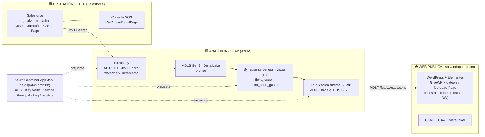

# 🐾 Portafolio · Vladislav Marinovich

**Sistemas de información *policy-grade* para organizaciones mission-driven de LATAM**

_Arquitectura · ingeniería de datos · IA aplicada — de la ingesta a la decisión_

---

## Qué es esto

> **No hago dashboards: construyo los sistemas que generan los datos correctos.**

Este repositorio es la **vitrina pública** de mi trabajo: **diagramas de arquitectura, decisiones de diseño y casos de estudio**. El **código vive en repositorios privados** — si quieres revisarlo, hay un botón de [🔑 solicitar acceso](#-solicitar-acceso-al-código) más abajo (te agrego como lector).

Mi enfoque: infraestructura que permite a organizaciones del **sector social y regulado** operar con datos confiables —y a futuro con agentes de IA— **sin alucinar y sin violar compliance** (Ley 1581 / Habeas Data).

---

## 🏗️ Proyecto insignia · Patitas Stack

El sistema de información end-to-end de la **Fundación Salvando Patitas** (donde soy CTO y cofundador): desde que un ciudadano reporta un animal en condición crítica hasta que el caso se cierra — con **trazabilidad financiera pública por caso**.

Su columna vertebral es un **split OLTP/OLAP**: Salesforce como cerebro operativo en tiempo real, y un warehouse serverless en Azure para analítica e investigación. La web pública es una **vitrina pasiva** que muestra cifras reales calculadas en el warehouse.

📐 **[Atlas completo de arquitectura →](docs/atlas/)** — 6 diagramas (vista panorámica, modelo de dominio, data platform, infraestructura cloud, web pública y el loop de transparencia).

### Por qué este diseño

| Decisión | Razón |
|---|---|
| **Split OLTP/OLAP** | Salesforce decide en tiempo real; el warehouse computa la historia una sola vez (sin recalcular en el operativo). |
| **Trazabilidad por caso** (caso padre + casos hijos) | Cada donación, gasto y pago queda vinculado al animal que lo originó → transparencia radical verificable. |
| **Serverless en el DW** | Se paga por *correr* la información, no por *tenerla* — sostenible para una ONG. |
| **Salesforce aislado de integraciones salientes** | El único *callout* de Salesforce es a Azure Blob (directo, vía Apex); SF **no** invoca servicios externos. Las integraciones viven fuera del org. |

---

## 📦 Repositorios

> Cada repo tiene su **ficha pública**. El código privado (🔒) se solicita **por repo** desde su ficha; **infra** queda restringido por seguridad (solo diagrama); la App (🌐) es pública.

| Repo | Qué es | Stack | Ficha |
|---|---|---|---|
| **Consola Operativa SOS** | Gestión end-to-end del caso (Salesforce) | Apex · LWC · Flows | [📄 ver ficha](docs/repos/consola.md) · 🔒 acceso por solicitud |
| **Data Warehouse** | Warehouse analítico · medallón bronze/silver/gold | Synapse serverless · SQL directo | [📄 ver ficha](docs/repos/data-warehouse.md) · 🔒 acceso por solicitud |
| **Infraestructura** | IaC · DW + pipeline + observabilidad | Terraform · Azure | [📄 ver ficha](docs/repos/fsp-infra.md) · 🔒 restringido (solo diagrama) |
| **App de Reporte Ciudadano** | Puerta de entrada del dato | React · TypeScript · Supabase | [📄 ver ficha](docs/repos/app.md) · 🌐 público |

---

## 🔬 Dirección de investigación

El sistema genera **datasets originales** del sector de protección animal en LATAM — un terreno donde no existe benchmark regional. Mi línea: **diseñar la trazabilidad pública de un sistema de información del sector social** para que la asimetría entre demanda ciudadana y capacidad organizacional opere como mecanismo de captación de recursos **sin instrumentalizar el sufrimiento del beneficiario**.

Métrica norte: **vidas salvadas por peso invertido.** Marco: *design science* + sistemas de información (no psicología de laboratorio — datos reales de campo capturados por el propio sistema).

---

## 🔑 Solicitar acceso al código

¿Eres profesor, investigador o evaluas mi perfil y quieres ver el código vivo? Hay dos caminos:

- **Botón de arriba** → abre una solicitud (issue) pre-llenada; te reviso y te agrego como **lector** de los repos que te interesen.
- **Correo directo** → [vladislav@marinovich.co](mailto:vladislav@marinovich.co?subject=Solicitud%20de%20acceso%20a%20repos%20-%20Portafolio)

También ofrezco, bajo invitación, **acceso de lectura a Atlassian** (Confluence + Jira) para mostrar la gestión real del proyecto: backlog, runbooks, ADRs y evolución de decisiones.

---

Construido con 🧡 en Bogotá · <a href="https://marinovich.co">Marinovich Consulting</a> · El código del bien también merece buena arquitectura

