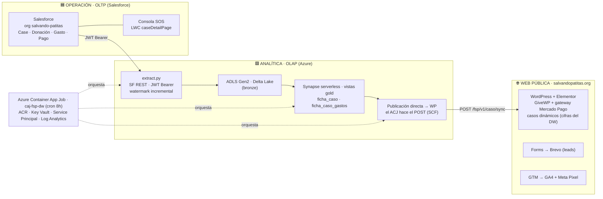
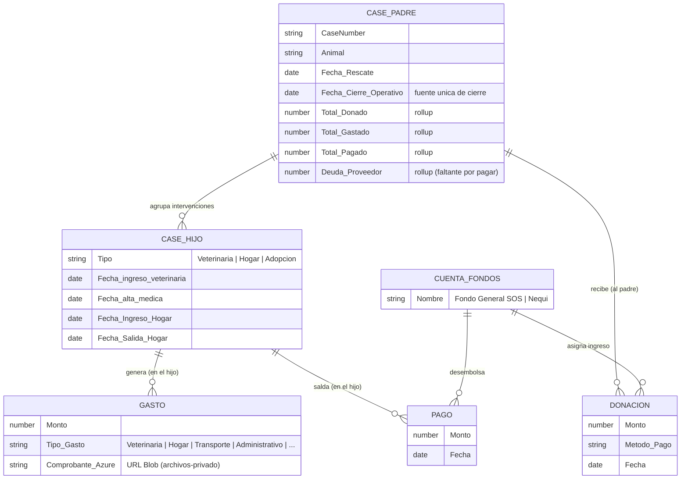
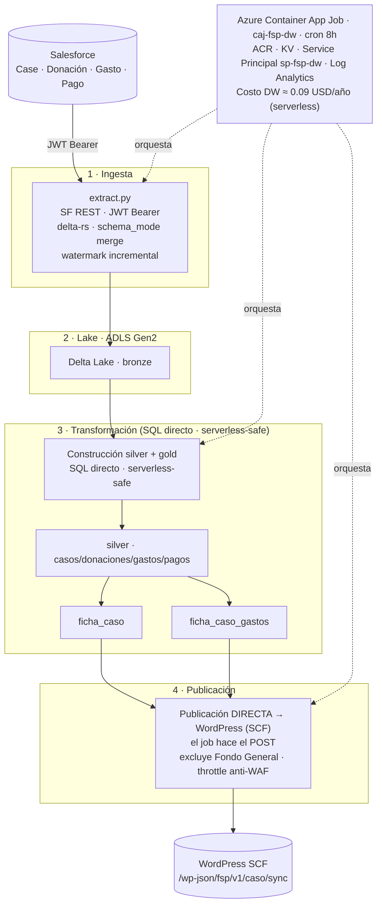
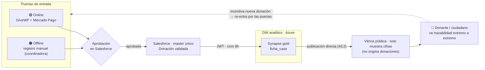
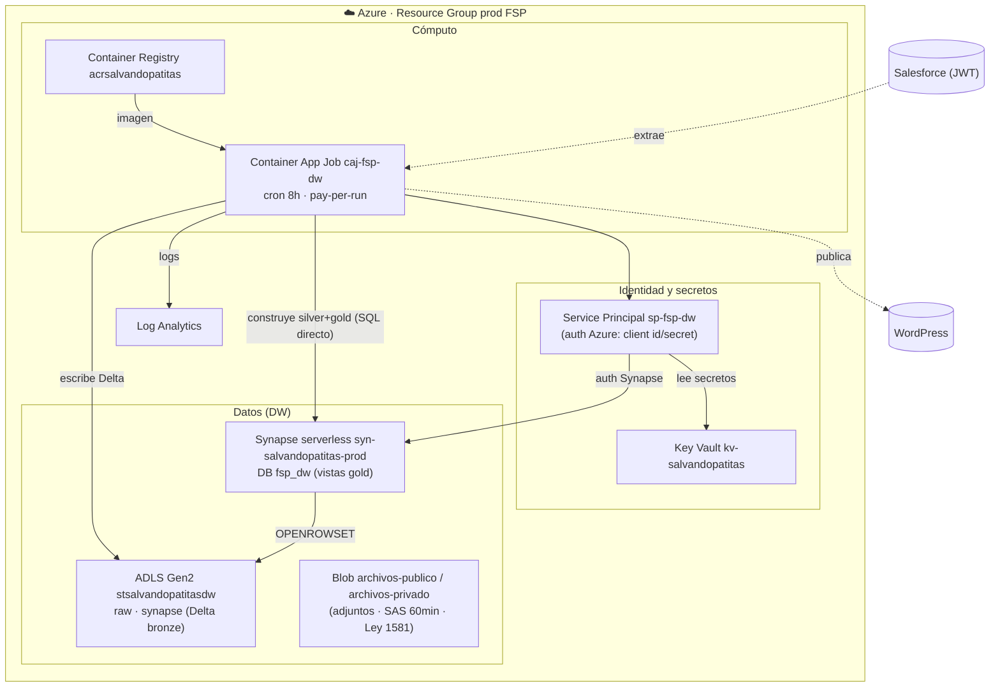
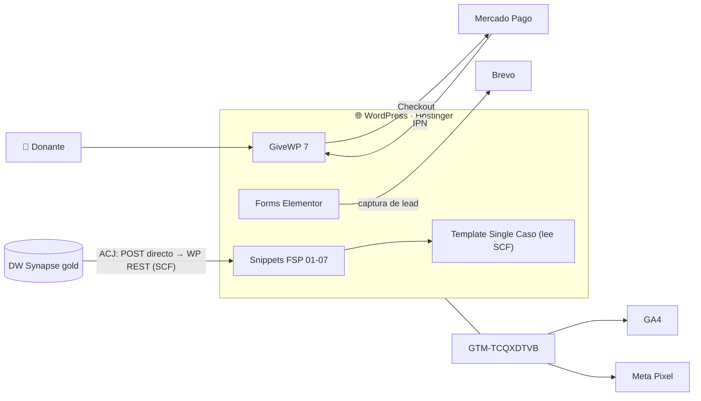

# Atlas de Sistema · Salvando Patitas

Diagramas arquitectónicos del sistema de información de la Fundación Salvando Patitas.

Cada diagrama existe en **dos formatos**:

- **`.mmd` (Mermaid)** — fuente canónica, versionada en git. Renderiza nativo en GitHub y Notion.
- **`.png`** — render pulido exportado de Miro (para portafolio / presentaciones).

> **Convención de nombres:** cada carpeta usa el código del Atlas (`A3.0`, `D1`, `D2`, `E1`) para que Confluence ↔ Miro ↔ GitHub ↔ Notion hablen el mismo idioma.

> **Nota de arquitectura (jun 2026):** el Data Warehouse analítico corre **100% en Azure** (Delta Lake + Synapse serverless). Transformación por **SQL directo serverless-safe** (dbt descartado) y **publicación directa a WordPress** (el Container App Job hace el POST). Fuente de verdad verificada contra prod: Confluence SOSV2 pág 31064066 (SSoT).

---

## A3.0 · Arquitectura Tecnológica — Vista Panorámica Modular

Vista de containers (equivalente C4). Separación OLTP (Salesforce) / OLAP (Azure) / Web pública.

<!-- Render Miro:  -->

---

## D1 · Modelo de dominio

Caso padre (consolidado) + casos hijos (intervenciones). Donaciones al padre; gastos/pagos al hijo; rollups en el padre.

<!-- Render Miro:  -->

---

## D2 · Data Platform — DW Synapse serverless

Pipeline SF → Delta Lake → Synapse (silver+gold por SQL directo, serverless-safe) → publicación directa a WordPress. dbt descartado (falla "rename" en Synapse serverless).

<!-- Render Miro:  -->

---

## E1 · Loop de Transparencia Radical · v2

SF master único + 2 puertas de entrada → aprobación → DW → vitrina pública con trazabilidad E2E.

<!-- Render Miro:  -->

---

## A5 · Infraestructura Cloud (Azure)

*Repo: `salvandopatitas/fsp-infra` (IaC · Terraform). Topología de recursos Azure que sostiene el DW.*

<!-- Render Miro:  -->

---

## A3.1 · Sistema Web Pública

*Repo: `salvandopatitas/wp-child-theme`. Vitrina pasiva: publica cifras del DW, gestiona donación, leads y medición.*

<!-- Render Miro:  -->

---

*Mantenedor: Vladislav Marinovich · arquitectura, código y metodología © 2026 **Vladislav Marinovich Vargas** (recursos propios) · operado por Marinovich Consulting S.A.S. · FSP recibe licencia de uso; los datos operativos son de la Fundación (Ley 1581).*
