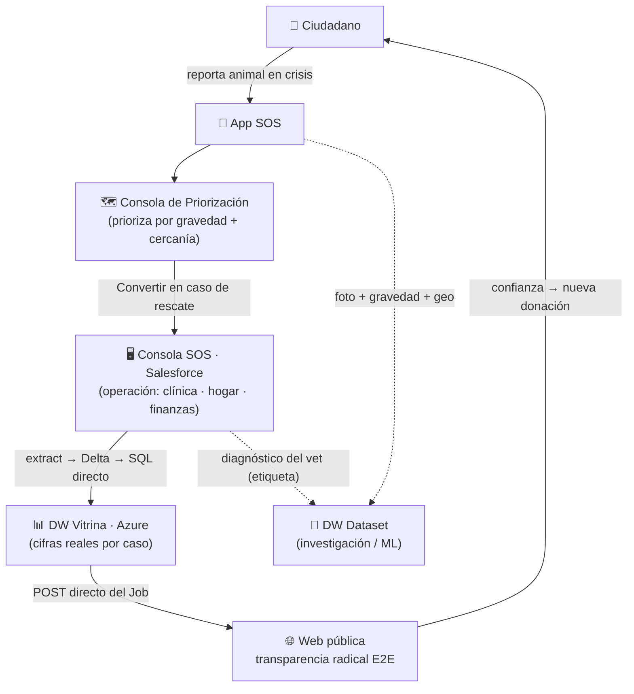

# 🧭 Cómo se conecta todo (y por qué lo diseñé así)

El Patitas Stack no son 4 proyectos sueltos: son **un solo loop**.

---

## El loop completo

1. El **ciudadano reporta** (App) → la **coordinación prioriza** (Consola de Priorización).
2. Al proceder, **se convierte en caso operativo** (Consola SOS) → gestión clínica, hogar de paso y finanzas.
3. El **DW de Vitrina** consolida las cifras reales por caso y las **publica a la web** → transparencia pública extremo a extremo.
4. Esa transparencia **genera confianza → nuevas donaciones** → el loop se realimenta.
5. En paralelo, **cada dato alimenta el dataset de investigación** (la foto del reporte + el diagnóstico del vet = par etiquetado).

## Por qué lo diseñé así

| Decisión transversal | Razón |
|---|---|
| **Split OLTP/OLAP** | Salesforce decide en tiempo real; el warehouse computa la historia una sola vez. No mezclar operación con analítica. |
| **Trazabilidad pública E2E** | La transparencia no es solo ética: la asimetría entre demanda y capacidad, hecha visible, **capta recursos** — sin instrumentalizar al beneficiario. |
| **Asset-light / serverless** | Una ONG no puede pagar infra always-on. Se paga por correr, no por tener. |
| **El dato en el centro** | El mismo dato sirve a 3 fines: operar, dar transparencia e investigar. Un solo activo, tres retornos. |
| **Una sola fuente de verdad** | Salesforce es el *master*; todo lo demás lee de ahí. Cero cálculo duplicado. |

## La metodología detrás

Este sistema instrumenta una **metodología operativa (4R)** del rescate animal — cómo cada etapa del loop corresponde a una fase del método.

> 📓 **El detalle de la metodología 4R vive en Notion** (es el complemento narrativo de este portafolio técnico). Este repo muestra *cómo se construyó el sistema*; Notion explica *el método que lo guía*.

---

<a href="../README.md">← Volver al portafolio</a>

