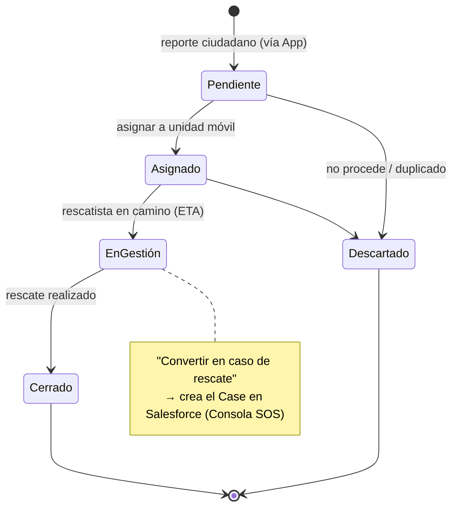

<div align="center">

# 📱 App SOS + Consola de Priorización de Rescate

**Proyecto 3 del Patitas Stack** · la puerta de entrada del dato + el despacho operativo

Repo canónico → org **`salvandopatitas`** *(en creación)* · MVP V0.1 hoy en `licencias-marinovich/sos-salvando-patitas` · 🎨 Consola de Priorización en diseño (v0.2)

</div>

---

## 🟢 Nivel 1 · Visión — qué resuelve

Hoy un animal en condición crítica en la calle **no tiene a dónde reportarse de forma trazable**. Este proyecto cierra ese hueco con dos piezas:

1. **App ciudadana** — cualquiera reporta desde el celular (video + fotos + ubicación + gravedad).
2. **Consola de Priorización** — la coordinación **ve todos los reportes en un mapa**, los **prioriza por gravedad y cercanía**, asigna unidades y, cuando procede, **convierte el reporte en un caso de rescate en Salesforce** (la [Consola SOS](consola-sos.md)).

Es el inicio del flujo: aquí **nace el dato** que después recorre todo el sistema.

## 🔵 Nivel 2 · Arquitectura — cómo funciona

*(Todo lo de este nivel es público: diagramas, diccionario de datos, dominio y máquinas de estado. El código vivo es el Nivel 3.)*

```
👤 Ciudadano → App (reporte) → Supabase + Azure Blob → 🗺️ Consola de Priorización
                                                              │  "Convertir en caso de rescate"
                                                              ▼
                                                    🖥️ Consola SOS (Salesforce)
```

- **App:** React 19 · Vite · TypeScript · Tailwind 4 · Supabase (Postgres/Auth) · Azure Blob · Leaflet.
- **Consola de Priorización:** vista combinada **mapa + lista**, orden por `gravedad ↓ · recencia`, filtros (gravedad, estado, tipo, fecha), cobertura multi-ciudad (Cartagena + Barranquilla). El botón **"Convertir en caso de rescate"** crea el Case en Salesforce — el puente entre el reporte ciudadano y la operación.

### Máquina de estados del reporte



Cada transición queda en `status_history` (quién, qué, cuándo) → trazabilidad completa del reporte.

### Diccionario de datos (Supabase)

| Tabla | Campos clave | Notas |
|---|---|---|
| `reports` | `id` · `animal_type` (canino/felino/ave/otro) · `severity` (baja/media/alta/crítica) · `lat`/`long` · `address` · `status` (pendiente/asignado/en_gestión/cerrado/descartado) · `anonymous_session_id` · `user_id` | reporte anónimo o autenticado |
| `evidences` | `id` · `report_id` · `file_url` · `file_type` | fotos/video en Azure Blob |
| `status_history` | `id` · `report_id` · `from`/`to` · `actor` · `at` | auditoría de transiciones |
| `profiles` | `id` · `role` (citizen / ngo_admin) | perfil extendido del usuario |

> 💡 **Para investigación:** `evidences.file_url` (foto) + `reports.severity` (etiqueta) + `lat/long` = **par imagen→etiqueta georreferenciado** → la semilla del [dataset público de reportes ciudadanos](dw-dataset-reportes-ciudadanos.md) y del triage por visión.

## 🔒 Nivel 3 · El código

El nivel más profundo: el código vivo, por solicitud de acceso.

- **App** → el repo canónico vivirá en el org **`salvandopatitas`** (en creación). El **MVP V0.1** está hoy en [`licencias-marinovich/sos-salvando-patitas`](https://github.com/licencias-marinovich/sos-salvando-patitas).
- **Consola de Priorización** → 🎨 en diseño (v0.2). El mockup de arriba es la directiva de diseño en curso.

---

<div align="center"><sub><a href="../../README.md">← Volver al portafolio</a></sub></div>
