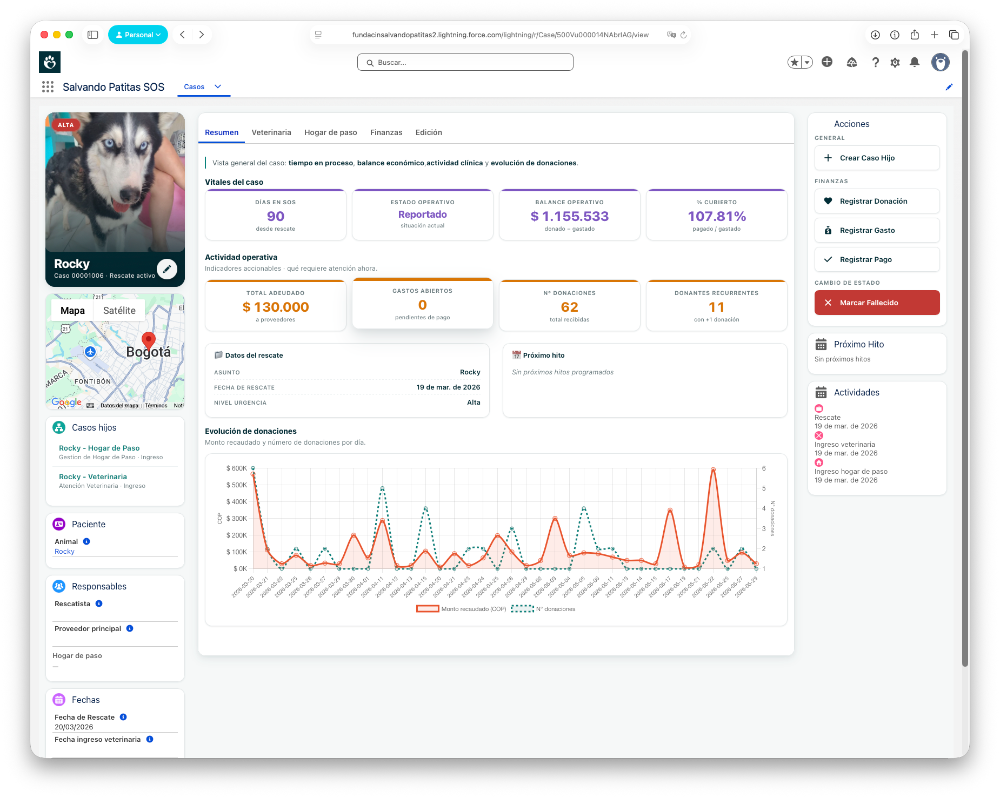
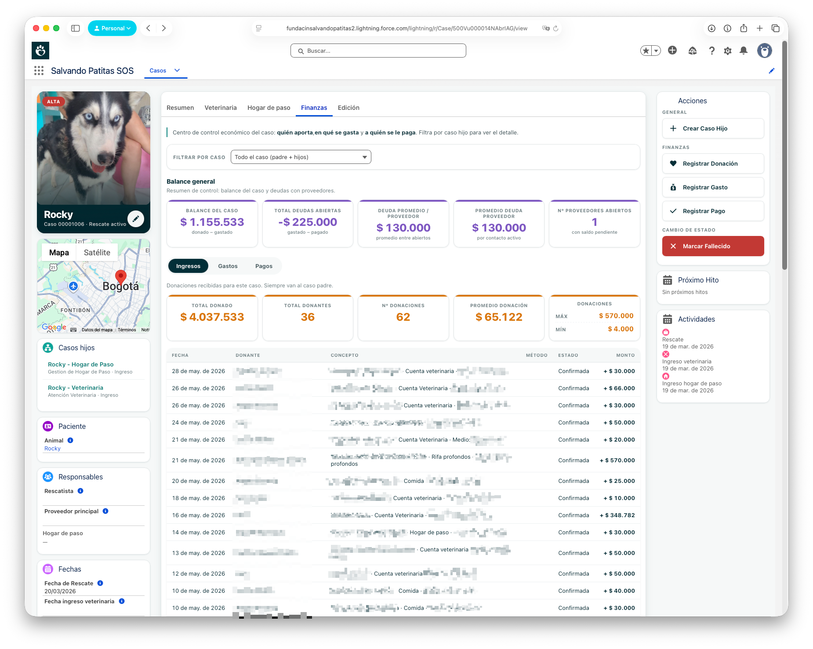
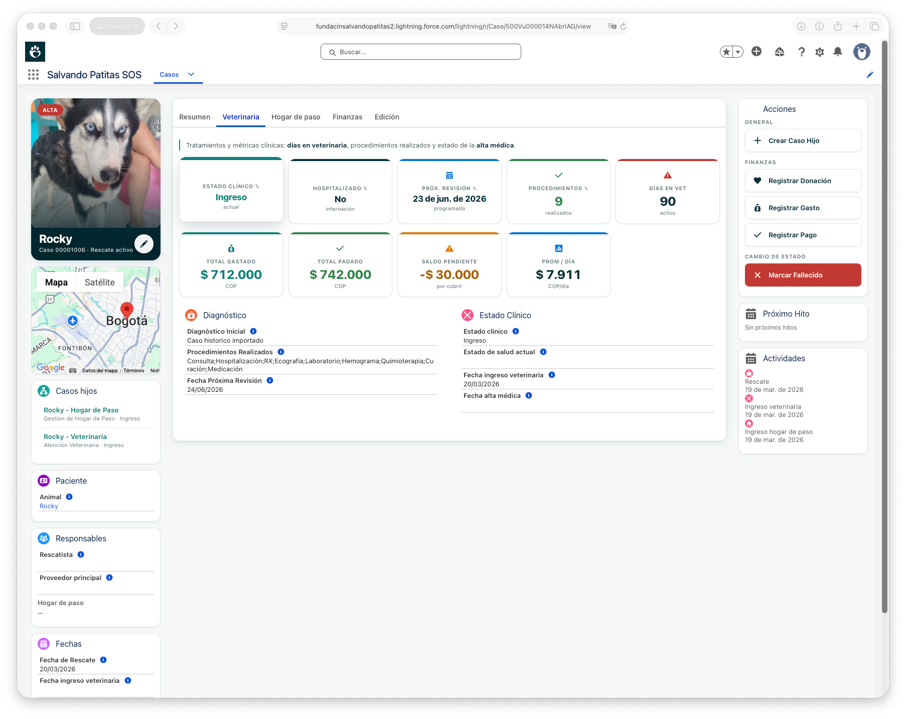
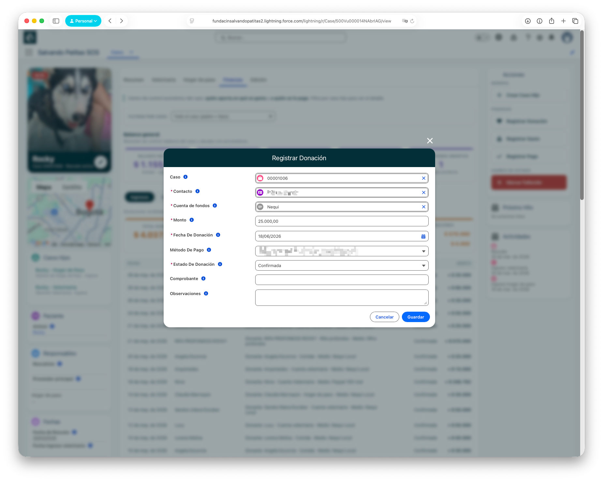
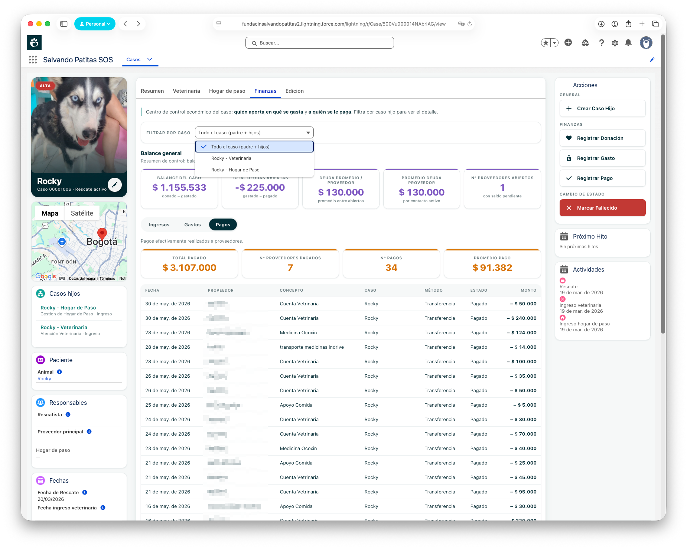
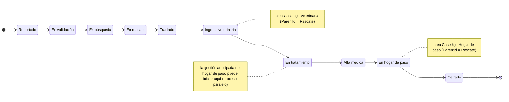
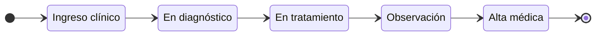
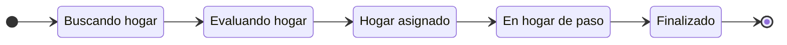

# 🖥️ Consola Operativa SOS

**Proyecto 1 del Patitas Stack** · el cerebro operativo del rescate

`salvandopatitas/sf-salvando-patitas-v2` · 🔒 repo privado · Salesforce

---

## 🟢 Nivel 1 · Visión — qué resuelve

El **cerebro operativo** de la Fundación. Gestiona el ciclo de vida completo de cada rescate —del reporte a la adopción— con **trazabilidad financiera por caso**: cada donación, gasto y pago queda vinculado al animal que lo originó. Es la fuente operativa de verdad del sistema.

## 📸 La Consola funcionando

> Capturas reales del sistema en operación. *Nombres de donantes y proveedores difuminados por Habeas Data (Ley 1581).*

**Resumen del caso** — KPIs vitales + evolución de donaciones:

**Pestaña Finanzas** — balance y movimientos por caso:

**Pestaña Veterinaria** — seguimiento clínico:

**Acción operativa** — registrar una donación (campos de contacto y método de pago difuminados):

**Selector de caso hijo** — alternar entre Rescate / Veterinaria / Hogar de paso:

## 🔵 Nivel 2 · Arquitectura

*(Todo este nivel es público: modelo, máquinas de estado, reglas. El código vivo es el Nivel 3.)*

### El modelo: un solo `Case` + Record Types + `ParentId`

Un único objeto **`Case`** modela las etapas operativas (vía **Record Types**) y las relaciones jerárquicas (vía **`ParentId`**): un **caso padre (Rescate)** agrupa **casos hijos** (Veterinaria, Hogar de paso). Donaciones → al padre; gastos/pagos → al hijo; **rollups** consolidan al padre (vía Flows, sin triggers Apex).

### Máquina de estados — Caso padre (Rescate)

### Máquina de estados — Caso hijo · Veterinaria

*Captura: diagnóstico · estado de salud · procedimientos · hospitalización · costos · evidencia médica.*

### Máquina de estados — Caso hijo · Hogar de paso

*Captura: hogar asignado · estado emocional · fecha ingreso/salida · costos · días en hogar (calculado).*

### Reglas de negocio (consistencia del flujo)

- No avanzar a **Veterinaria** sin Case hijo Veterinaria.
- No avanzar a **Hogar de paso** sin Case hijo Hogar.
- Veterinaria requiere **Ingreso** antes de **Tratamiento**.
- **Alta médica** requiere consistencia (datos completos).
- **No cerrar** el caso padre si hay **hijos abiertos**.
- No avanzar a **"En hogar de paso"** sin: **Alta médica** + **Hogar asignado**.

### Decisiones de arquitectura

| Decisión | Razón |
|---|---|
| **Un solo `Case` + Record Types** (no objeto custom) | Modela etapas y jerarquía con lo nativo de la plataforma |
| **Split OLTP/OLAP** — SF operativo + [warehouse analítico](dw-vitrina-publica.md) | SF decide en tiempo real; el warehouse computa la historia |
| **Archivos en Azure Blob** · buckets público/privado con SAS | Límite de storage SF nonprofit + Ley 1581 (PII en bucket privado) |
| **`Fecha_Cierre_Operativo__c` = única fuente de verdad del cierre** | Las fórmulas de tiempo paran con cualquier motivo de cierre |
| **Salesforce aislado de integraciones salientes** | El único callout de SF es a Azure Blob; las integraciones viven fuera del org |

📐 Más diagramas: [modelo de dominio (D1)](../atlas/README.md#d1--modelo-de-dominio) · [panorámica (A3.0)](../atlas/README.md#a30--arquitectura-tecnológica--vista-panorámica-modular).

## 🔒 Nivel 3 · El código

El nivel más profundo: el código vivo (Apex · LWC · Flows), por solicitud de acceso.

---

<a href="../../README.md">← Volver al portafolio</a>

