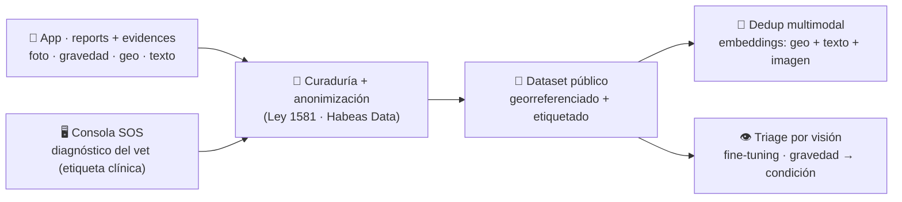

# 🔬 DW · Dataset de Reportes Ciudadanos

**Proyecto 4 del Patitas Stack** · el activo de investigación · 🚧 en construcción

Dataset público, original y georreferenciado · línea de investigación (visión + dedup)

---

## 🟢 Nivel 1 · Visión — qué resuelve

En LATAM **no existe** un dataset abierto del sector de protección animal. Este proyecto construye uno: **reportes ciudadanos georreferenciados del Caribe colombiano**, con foto, gravedad y desenlace clínico. Datos que antes no existían → base para investigación reproducible y para entrenar modelos que **prioricen mejor los rescates**.

## 🔵 Nivel 2 · Arquitectura

*(Diseño de la línea de investigación. El código aún no existe — ver Nivel 3.)*

### De dónde sale el dato (y por qué es valioso)

El sistema genera **datos etiquetados sin esfuerzo extra**: la [App](app-sos-priorizacion.md) captura **foto + gravedad + geo**, y la [Consola SOS](consola-sos.md) registra el **diagnóstico confirmado por el veterinario** (la etiqueta clínica). El par **foto ↔ etiqueta** es dato de entrenamiento que el propio loop operativo produce.

### Roadmap de modelos

- **Etapa 1 — Dedup multimodal:** varios reportes del mismo animal (geo + texto + imagen) → un solo caso. Usa embeddings pre-entrenados (barato, inferencia). Contribución de ML publicable, no solo operativa.
- **Etapa 2 — Triage por visión:** *fine-tuning* sobre el dataset etiquetado → de la foto a una **sospecha de gravedad/condición** (atropello, sarna, desnutrición — lo visualmente expresado).
  - ⚠️ **Framing obligatorio:** *decision-support* / sospecha visual, **nunca diagnóstico**. El veterinario confirma.
  - ⚠️ **Alcance honesto:** condiciones no visuales (moquillo, virales) **no** se prometen.

### Blindaje (Habeas Data)

El dataset público es **anonimizado y consentido**; la separación de IP (datos operativos de la ONG vs dataset curado) se respeta por diseño.

## 🔒 Nivel 3 · El código

🚧 **En construcción.** Hoy es la **línea de investigación** y el diseño; el dato crudo ya se acumula en la App (Supabase) y la Consola SOS. El repo del dataset/pipeline de ML se creará en el org `salvandopatitas` cuando arranque la fase de modelos.

> Es el **moat** del proyecto: el dato sectorial original no se replica fácil.

---

<a href="../../README.md">← Volver al portafolio</a>

