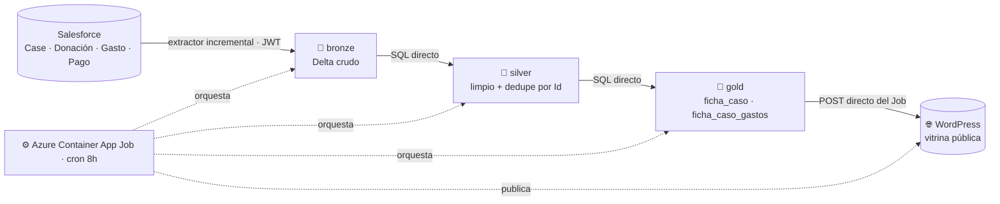
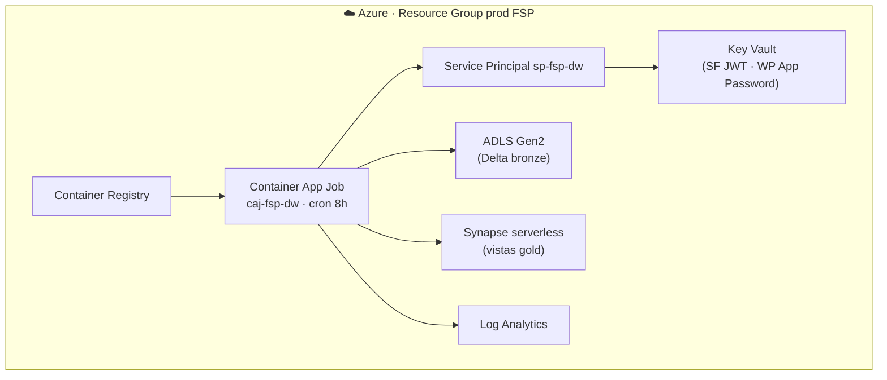

# 📊 DW · Vitrina Pública (Transparencia)

**Proyecto 2 del Patitas Stack** · las cifras reales por caso, públicas

`salvandopatitas/fsp-data-warehouse` · 🔒 privado · + `salvandopatitas/fsp-infra` · 🔒 restringido

---

## 🟢 Nivel 1 · Visión — qué resuelve

La promesa de **transparencia radical**: cada peso donado, trazable públicamente desde la donación hasta la factura del veterinario. Este DW **calcula las cifras reales por caso** (donado, gastado, pagado, faltante) en una sola capa auditable y las publica en la web — eliminando los desfases que generaba calcular en el operativo (Salesforce).

## 🔵 Nivel 2 · Arquitectura

*(Todo público: pipeline, diccionario, reglas. El código vivo es el Nivel 3.)*

### Pipeline (medallón · 100% Azure serverless)

**Transformación por SQL directo serverless-safe** (dbt descartado: rompe con *"rename"* en Synapse serverless). **Publicación directa**: el propio Job hace el POST a la REST de WordPress (sin intermediarios). Se paga por *correr* la info, no por *tenerla*.

### Diccionario de datos — gold `ficha_caso`

| Campo | Significado |
|---|---|
| `sf_case_id` | llave de unión con WordPress (= `Case.Id`) |
| `numero_caso` · `estado_operativo` | identificación y etapa del caso padre |
| `meta` | total gastado (lo gastado es la meta de recaudo) |
| `donado` · `pagado` | Σ donaciones confirmadas · Σ pagos realizados |
| `faltante_recaudar` · `faltante_pagar` | `max(gastado−donado,0)` · deuda con proveedor |
| `pct_cubierto` · `num_donaciones` · `num_donantes` | indicadores de la vitrina |

### Reglas de negocio (cuadre de cifras)

- **Donación → caso padre**; Gasto/Pago → caso hijo (cadena Pago→Gasto→Caso).
- **Meta = total gastado.** `faltante_recaudar = max(gastado − donado, 0)`.
- **Fondo General** excluido (es la bolsa de la fundación, no un caso).
- En la vitrina aparecen **solo los casos padre** (todo consolidado).
- La web es **vitrina pasiva**: solo lee `ficha_caso`, no calcula nada.

### La infraestructura que lo sostiene (A5)

> 🔐 **El código de infraestructura (`fsp-infra`) está restringido — a propósito.** Describe la topología exacta de producción y su postura de seguridad; exponerlo equivaldría a entregar el mapa de la superficie de ataque. Mostramos la **arquitectura** (este diagrama), no el detalle de implementación. Principio de **mínima exposición**.

## 🔒 Nivel 3 · El código

- **DW** (`fsp-data-warehouse`) → 🔒 por solicitud de acceso.

  

- **Infraestructura** (`fsp-infra`) → 🔒 **restringido** (ver recuadro arriba). Sin acceso al código por seguridad.

📐 Más diagramas: [data platform (D2)](../atlas/README.md#d2--data-platform--dw-synapse-serverless) · [infra (A5)](../atlas/README.md#a5--infraestructura-cloud-azure) · [loop de transparencia (E1)](../atlas/README.md).

---

<a href="../../README.md">← Volver al portafolio</a>

