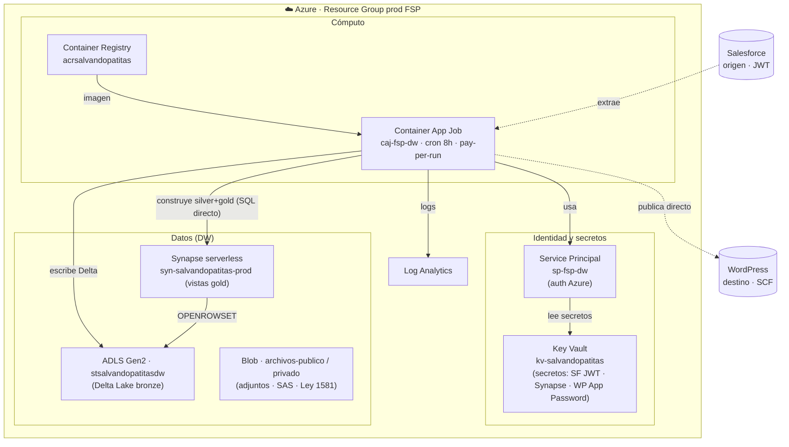

# ☁️ Infraestructura como código

**`salvandopatitas/fsp-infra`** · 🔒 repo restringido (sin acceso al código — [ver por qué](#-por-qué-este-repo-no-se-comparte))

---

## Qué es

El **Terraform** que describe y adopta la plataforma de datos de la Fundación en **Azure** (Brazil South): el Data Warehouse serverless (Synapse + Data Lake), el pipeline de sincronización (Container App Job) y su soporte (Key Vault, ACR, Service Principal, Log Analytics).

**Stack:** Terraform · Azure · 100% serverless / pay-per-use.

## Topología (diagrama A5)

## Principios

- **NO recrear producción** — el repo **adopta** la infra existente (`terraform import`); `plan` debe salir sin cambios antes de cualquier `apply`.
- **Secretos solo en Key Vault** — nunca en el repo ni en el estado.
- **Estado remoto** en el Data Lake (`azurerm` backend).

## 🔒 Por qué este repo NO se comparte

A diferencia de los demás, el código de infraestructura **no tiene acceso por solicitud — y es deliberado.** Este repo describe la **topología exacta de producción** y su postura de seguridad (identidades, políticas, endpoints, manejo de secretos). Exponerlo, incluso en solo lectura, equivaldría a entregar el **mapa de la superficie de ataque** del sistema.

Por eso aquí mostramos **la arquitectura** (el diagrama de arriba) y los **principios** de diseño, pero **no el detalle de implementación**. Es el principio de **mínima exposición**: se comparte lo necesario para entender el sistema, no para vulnerarlo.

---

<a href="../../README.md">← Volver al portafolio</a>

